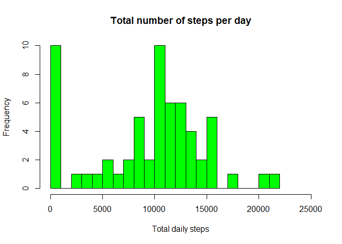
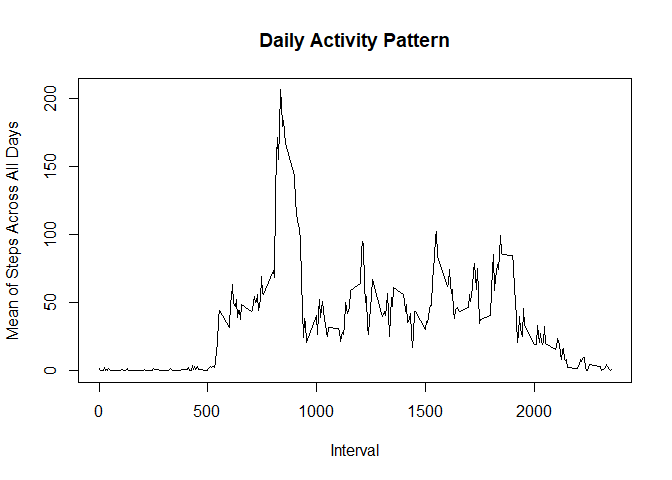
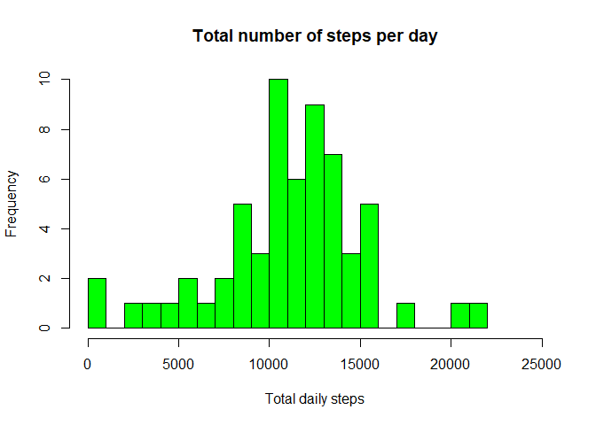
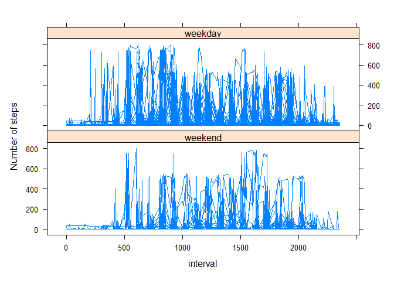

## Loading and preprocessing the data

```r
df <- read.csv(unz("activity.zip", "activity.csv"), header=T, sep="," )
df$date <- as.Date(df$date)
dim(df)
```

```
## [1] 17568     3
```

```r
summary(df)
```

```
##      steps             date               interval     
##  Min.   :  0.00   Min.   :2012-10-01   Min.   :   0.0  
##  1st Qu.:  0.00   1st Qu.:2012-10-16   1st Qu.: 588.8  
##  Median :  0.00   Median :2012-10-31   Median :1177.5  
##  Mean   : 37.38   Mean   :2012-10-31   Mean   :1177.5  
##  3rd Qu.: 12.00   3rd Qu.:2012-11-15   3rd Qu.:1766.2  
##  Max.   :806.00   Max.   :2012-11-30   Max.   :2355.0  
##  NA's   :2304
```


## What is mean total number of steps taken per day?


```r
library(dplyr)
```

```
## 
## Attaching package: 'dplyr'
```

```
## The following objects are masked from 'package:stats':
## 
##     filter, lag
```

```
## The following objects are masked from 'package:base':
## 
##     intersect, setdiff, setequal, union
```

```r
dailySteps <- df %>%
  group_by(date)%>%
  summarise(sumSteps = sum(steps, na.rm = TRUE))
#dailySteps
hist(dailySteps$sumSteps, breaks = 25,
     main = "Total number of steps per day",
     xlab = "Total daily steps",
     col = "green",
     xlim = c(0,25000))
```

<!-- -->


### Calculate and report the mean and median of the total number of steps taken per day

```r
totalStepsMean <- mean(dailySteps$sumSteps, na.rm = T)
totalStepsMedian <- median(dailySteps$sumSteps, na.rm = T)

print(paste("The mean of the total number of steps taken per day is",totalStepsMean ,"and the median is" ,totalStepsMedian ,"."))
```

```
## [1] "The mean of the total number of steps taken per day is 9354.22950819672 and the median is 10395 ."
```

## What is the average daily activity pattern?


```r
dailyActivity <- as.data.frame(df %>%
    group_by(interval) %>%
    summarise(avgActivity = mean(steps, na.rm = TRUE)))

plot(dailyActivity$interval, dailyActivity$avgActivity, 
     type = "l", 
     xlab = "Interval", 
     ylab= "Mean of Steps Across All Days", 
     main = "Daily Activity Pattern")
```

<!-- -->


### Which 5-minute interval, on average across all the days in the dataset, contains the maximum number of steps?

```r
dailyActivity[dailyActivity[,"avgActivity"] == max(dailyActivity$avgActivity),]$interval
```

```
## [1] 835
```

## Imputing missing values


###Calculate and report the total number of missing values in the dataset (i.e. the total number of rows with NAs)


```r
table(is.na(df))["TRUE"]
```

```
## TRUE 
## 2304
```


### Devise a strategy for filling in all of the missing values in the dataset. The strategy does not need to be sophisticated

```r
library(mice)
```

```
## Warning: package 'mice' was built under R version 4.1.1
```

```
## 
## Attaching package: 'mice'
```

```
## The following object is masked from 'package:stats':
## 
##     filter
```

```
## The following objects are masked from 'package:base':
## 
##     cbind, rbind
```

```r
tempData <- mice(df,m=5,maxit=50,meth='pmm',seed=500)
```

```
## 
##  iter imp variable
##   1   1  steps
##   1   2  steps
##   1   3  steps
##   1   4  steps
##   1   5  steps
##   2   1  steps
##   2   2  steps
##   2   3  steps
##   2   4  steps
##   2   5  steps
##   3   1  steps
##   3   2  steps
##   3   3  steps
##   3   4  steps
##   3   5  steps
##   4   1  steps
##   4   2  steps
##   4   3  steps
##   4   4  steps
##   4   5  steps
##   5   1  steps
##   5   2  steps
##   5   3  steps
##   5   4  steps
##   5   5  steps
##   6   1  steps
##   6   2  steps
##   6   3  steps
##   6   4  steps
##   6   5  steps
##   7   1  steps
##   7   2  steps
##   7   3  steps
##   7   4  steps
##   7   5  steps
##   8   1  steps
##   8   2  steps
##   8   3  steps
##   8   4  steps
##   8   5  steps
##   9   1  steps
##   9   2  steps
##   9   3  steps
##   9   4  steps
##   9   5  steps
##   10   1  steps
##   10   2  steps
##   10   3  steps
##   10   4  steps
##   10   5  steps
##   11   1  steps
##   11   2  steps
##   11   3  steps
##   11   4  steps
##   11   5  steps
##   12   1  steps
##   12   2  steps
##   12   3  steps
##   12   4  steps
##   12   5  steps
##   13   1  steps
##   13   2  steps
##   13   3  steps
##   13   4  steps
##   13   5  steps
##   14   1  steps
##   14   2  steps
##   14   3  steps
##   14   4  steps
##   14   5  steps
##   15   1  steps
##   15   2  steps
##   15   3  steps
##   15   4  steps
##   15   5  steps
##   16   1  steps
##   16   2  steps
##   16   3  steps
##   16   4  steps
##   16   5  steps
##   17   1  steps
##   17   2  steps
##   17   3  steps
##   17   4  steps
##   17   5  steps
##   18   1  steps
##   18   2  steps
##   18   3  steps
##   18   4  steps
##   18   5  steps
##   19   1  steps
##   19   2  steps
##   19   3  steps
##   19   4  steps
##   19   5  steps
##   20   1  steps
##   20   2  steps
##   20   3  steps
##   20   4  steps
##   20   5  steps
##   21   1  steps
##   21   2  steps
##   21   3  steps
##   21   4  steps
##   21   5  steps
##   22   1  steps
##   22   2  steps
##   22   3  steps
##   22   4  steps
##   22   5  steps
##   23   1  steps
##   23   2  steps
##   23   3  steps
##   23   4  steps
##   23   5  steps
##   24   1  steps
##   24   2  steps
##   24   3  steps
##   24   4  steps
##   24   5  steps
##   25   1  steps
##   25   2  steps
##   25   3  steps
##   25   4  steps
##   25   5  steps
##   26   1  steps
##   26   2  steps
##   26   3  steps
##   26   4  steps
##   26   5  steps
##   27   1  steps
##   27   2  steps
##   27   3  steps
##   27   4  steps
##   27   5  steps
##   28   1  steps
##   28   2  steps
##   28   3  steps
##   28   4  steps
##   28   5  steps
##   29   1  steps
##   29   2  steps
##   29   3  steps
##   29   4  steps
##   29   5  steps
##   30   1  steps
##   30   2  steps
##   30   3  steps
##   30   4  steps
##   30   5  steps
##   31   1  steps
##   31   2  steps
##   31   3  steps
##   31   4  steps
##   31   5  steps
##   32   1  steps
##   32   2  steps
##   32   3  steps
##   32   4  steps
##   32   5  steps
##   33   1  steps
##   33   2  steps
##   33   3  steps
##   33   4  steps
##   33   5  steps
##   34   1  steps
##   34   2  steps
##   34   3  steps
##   34   4  steps
##   34   5  steps
##   35   1  steps
##   35   2  steps
##   35   3  steps
##   35   4  steps
##   35   5  steps
##   36   1  steps
##   36   2  steps
##   36   3  steps
##   36   4  steps
##   36   5  steps
##   37   1  steps
##   37   2  steps
##   37   3  steps
##   37   4  steps
##   37   5  steps
##   38   1  steps
##   38   2  steps
##   38   3  steps
##   38   4  steps
##   38   5  steps
##   39   1  steps
##   39   2  steps
##   39   3  steps
##   39   4  steps
##   39   5  steps
##   40   1  steps
##   40   2  steps
##   40   3  steps
##   40   4  steps
##   40   5  steps
##   41   1  steps
##   41   2  steps
##   41   3  steps
##   41   4  steps
##   41   5  steps
##   42   1  steps
##   42   2  steps
##   42   3  steps
##   42   4  steps
##   42   5  steps
##   43   1  steps
##   43   2  steps
##   43   3  steps
##   43   4  steps
##   43   5  steps
##   44   1  steps
##   44   2  steps
##   44   3  steps
##   44   4  steps
##   44   5  steps
##   45   1  steps
##   45   2  steps
##   45   3  steps
##   45   4  steps
##   45   5  steps
##   46   1  steps
##   46   2  steps
##   46   3  steps
##   46   4  steps
##   46   5  steps
##   47   1  steps
##   47   2  steps
##   47   3  steps
##   47   4  steps
##   47   5  steps
##   48   1  steps
##   48   2  steps
##   48   3  steps
##   48   4  steps
##   48   5  steps
##   49   1  steps
##   49   2  steps
##   49   3  steps
##   49   4  steps
##   49   5  steps
##   50   1  steps
##   50   2  steps
##   50   3  steps
##   50   4  steps
##   50   5  steps
```

```r
summary(tempData)
```

```
## Class: mids
## Number of multiple imputations:  5 
## Imputation methods:
##    steps     date interval 
##    "pmm"       ""       "" 
## PredictorMatrix:
##          steps date interval
## steps        0    1        1
## date         1    0        1
## interval     1    1        0
```


### Create a new dataset that is equal to the original dataset but with themissing data filled in.


```r
completedDf <- complete(tempData,1)
```


### Make a histogram of the total number of steps taken each day and Calculate
### and report the mean and median total number of steps taken per day. Do
### these values differ from the estimates from the first part of the assignment?
### What is the impact of imputing missing data on the estimates of the total
### daily number of steps?###

```r
dailySteps2 <- completedDf %>%
  group_by(date)%>%
  summarise(sumSteps = sum(steps, na.rm = TRUE))

hist(dailySteps2$sumSteps, breaks = 25,
     main = "Total number of steps per day",
     xlab = "Total daily steps",
     col = "green",
     xlim = c(0,25000))
```

<!-- -->

```r
totalStepsMean2 <- mean(dailySteps2$sumSteps, na.rm = T)
totalStepsMedian2 <- median(dailySteps2$sumSteps, na.rm = T)

print(paste("The mean of the total number of steps taken per day is",totalStepsMean2 ,"and the median is" ,totalStepsMedian2 ,"."))
```

```
## [1] "The mean of the total number of steps taken per day is 11051.1475409836 and the median is 11352 ."
```

## Are there differences in activity patterns between weekdays and weekends?


```r
library(ggplot2)
```

```
## Warning: package 'ggplot2' was built under R version 4.1.1
```

```r
library(lattice)
week <- c("Mon","Tue","Wed","Thu","Fri")

df1 <- completedDf %>%
  mutate(wday = weekdays(date, abbreviate = TRUE), wday = factor((wday %in% week), levels = c(FALSE, TRUE), labels=c('weekend', 'weekday'))) %>%
  group_by(date, interval, wday) %>%
  summarise(avg = mean(steps), date, wday, .groups = "keep")
  
xyplot(avg~interval|wday, df1, type='l', lty = 1, lwd = 0.5, ylab = "Number of steps", layout = c(1,2))
```

<!-- -->
